<div align="center">

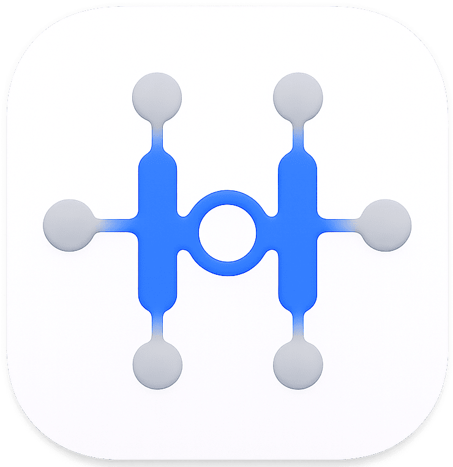

# MacPeripheralHub

[](https://github.com/TheAndreyZakharov/MacPeripheralHub/blob/main/README_RU.md)
[](https://github.com/TheAndreyZakharov/MacPeripheralHub/blob/main/README.md)

</div>

## Harvard CS50x 2026 Final Project

- Course: CS50x 2026 — Harvard University's Introduction to Computer Science
- Project title: MacPeripheralHub
- Author: Andrey Zakharov
- GitHub username: `TheAndreyZakharov`
- edX username: `TheAndreyZakharov`
- City and country: Moscow, Russia
- Recording date: TODO
- Video Demo: https://www.youtube.com/watch?v=by53T03Eeds
- Submission command: `submit50 cs50/problems/2026/x/project`

<div align="center">

[](https://www.youtube.com/watch?v=by53T03Eeds)

</div>

The video link above is a temporary placeholder.

## Project overview

MacPeripheralHub is a macOS application for seeing connected peripheral devices, switching active audio devices quickly, and keeping selected system audio defaults stable.

The application is built as a normal macOS desktop app with a real window, a menu bar item, background watchers, profile storage, and direct integration with macOS system APIs.

When the main window is closed with the red close button, MacPeripheralHub disappears from the Dock and continues working from the menu bar near the macOS clock.

The public application version is `1.0.0`.

## Purpose

MacPeripheralHub is made for Mac setups where many devices are connected, disconnected, paired, or awakened during the day.

macOS and individual applications can change the default microphone or output after a headset, dock, monitor, USB hub, or Bluetooth device appears.

For example, a user can choose a USB microphone as the default input, connect AirPods later, and macOS may move the default input to the AirPods microphone.

MacPeripheralHub keeps the chosen audio input, audio output, and system output selected by watching system changes and restoring the desired devices.

## Supported devices

The inventory view is designed to show as much connected peripheral hardware as macOS exposes.

Device categories:

- displays and built-in screens;
- microphones;
- headphones, speakers, and other audio outputs;
- audio interfaces and sound cards;
- cameras and webcams;
- keyboards;
- mice;
- trackpads;
- Bluetooth devices;
- USB devices;
- USB hubs and docking stations;
- unknown or partially identified devices.

For every device, the app shows the best available details: name, category, manufacturer, model, serial number, transport, connection status, and role-specific characteristics.

For displays, the app can show resolution, refresh rate, main display status, and available connection metadata.

For audio devices, the app can show channels, sample rate, and whether the device is the current default input, output, or system output.

For cameras, HID devices, USB devices, and Bluetooth devices, the app shows identifiers and metadata when macOS provides them.

## Core feature

The main protected workflow in version `1.0.0` is stable audio default control.

MacPeripheralHub stores either an active profile or the current manual selection.

When macOS changes the default input, output, or system output away from the selected device, the reconciliation engine decides whether the app should restore it.

The app uses debounce and retry behavior so it does not fight macOS too aggressively while devices are still appearing after connection, wake, or Bluetooth pairing.

Manual switching does not overwrite saved profiles. It moves the active state into `Manual Control`, so the user can change devices for the moment without destroying a saved setup.

## Device checks

The `Devices` view includes built-in checks for media peripherals.

For headphones, speakers, and audio outputs, press `Glass` to play the macOS Glass system sound through the selected output.

The audio output check has a `Mono` option for centered mono playback.

For microphones, press `Listen` to open live monitoring with per-channel level meters.

The microphone monitor also has a `Mono` option for mono monitoring and mono level display.

For cameras, press `Preview` to open a medium preview window for checking framing, focus, and exposure.

Microphone and camera checks request macOS permissions only when the user starts the check.

`Settings` shows microphone and camera permission status with actions to request access again or open the exact macOS Privacy Settings page.

## Installation from GitHub Release

The ready-to-use macOS application is available from the repository's GitHub Releases section.

Download the latest release assets from GitHub Releases.

The release includes both the application bundle and its checksum file.

Release assets:

    MacPeripheralHub.app.zip
    MacPeripheralHub.app.zip.sha256

Place `MacPeripheralHub.app.zip` and `MacPeripheralHub.app.zip.sha256` in the same folder.

Verify the archive:

    shasum -a 256 -c MacPeripheralHub.app.zip.sha256

Extract the archive:

    unzip MacPeripheralHub.app.zip

Move the application to `Applications` if desired:

    mv "MacPeripheralHub.app" /Applications/

On first launch, macOS may warn that the application is not signed or notarized.

In that case, right-click the application and choose `Open`.

If quarantine blocks launch, remove the quarantine attribute:

    xattr -cr "MacPeripheralHub.app"

or, after moving it to Applications:

    xattr -cr "/Applications/MacPeripheralHub.app"

## Application walkthrough

This section shows the main workflows and the places where MacPeripheralHub controls or explains connected devices.

### Manual Control

<div align="center">
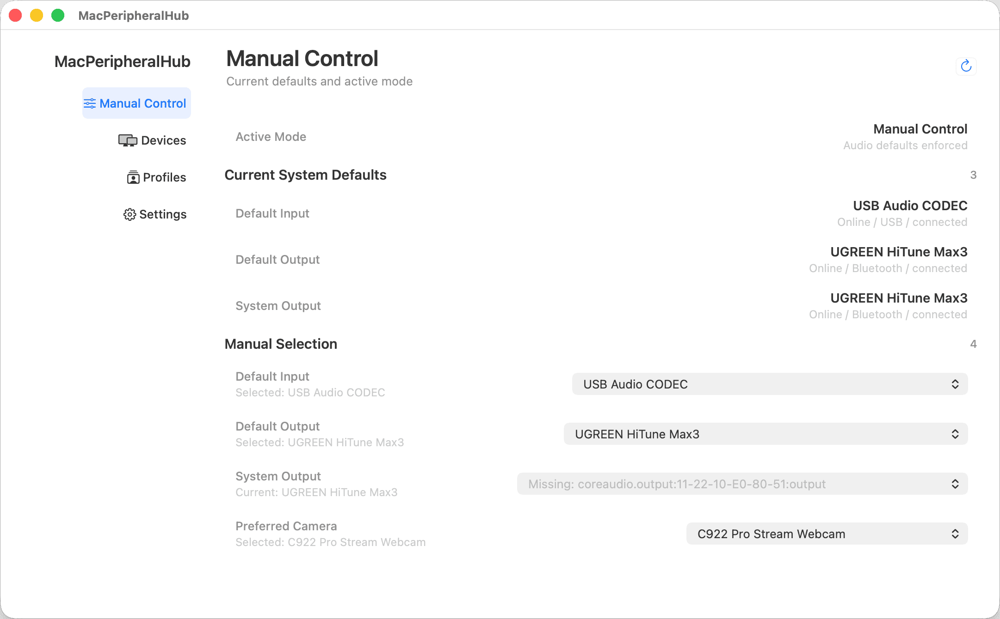
</div>

`Manual Control` is the first tab and the fastest place to set current defaults manually.

It lets the user choose the active input, output, system output, and preferred camera without changing saved profiles.

After a manual switch, the app keeps the current state as manual control until another profile is activated.

### Devices

<div align="center">
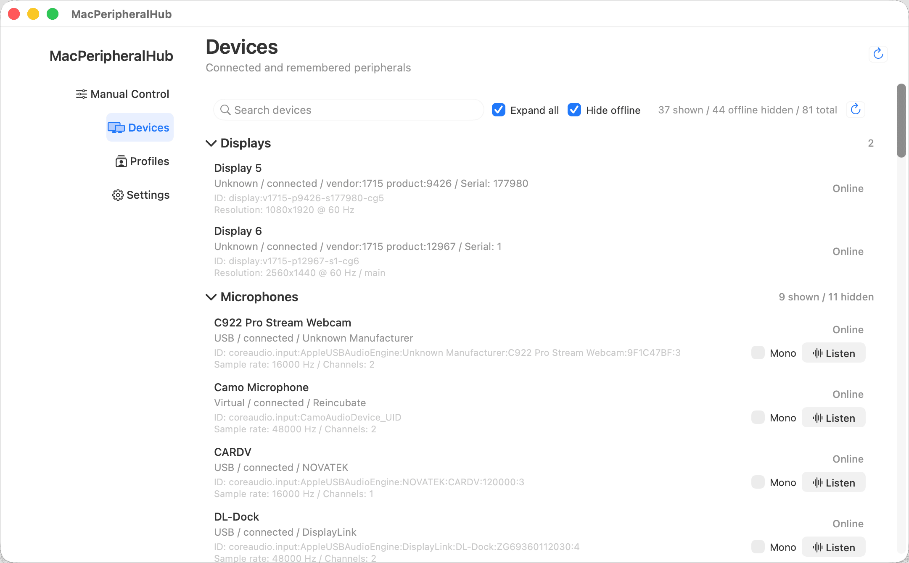
</div>

`Devices` shows all connected hardware that macOS exposes to the app, including wired, wireless, audio, video, USB, Bluetooth, display, HID, hub, and unknown devices.

Devices are grouped by category, with expandable sections and detected metadata for understanding what each device is.

Media devices can be checked directly: microphones can be monitored live, outputs can play the Glass sound, and cameras can be previewed.

### Profiles

<div align="center">
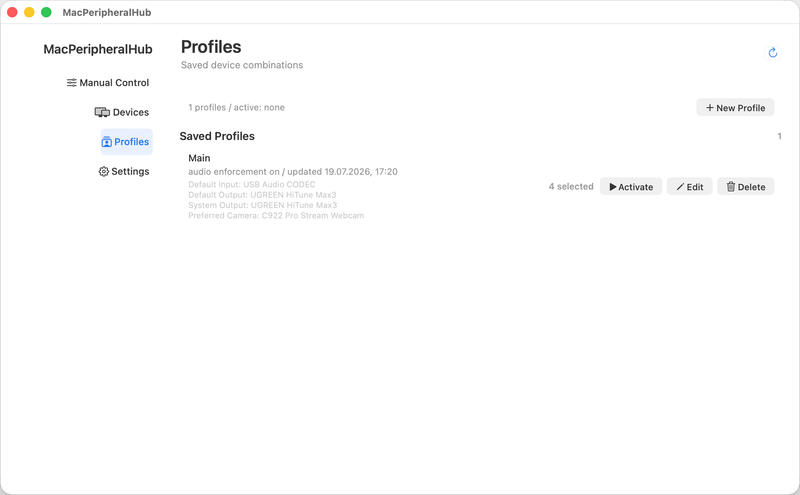
</div>

`Profiles` is for reusable device combinations for different tasks, rooms, calls, streams, or work scenarios.

A profile can store selected input, output, system output, preferred camera, and expected peripherals.

Profiles can be created, edited, deleted, and activated quickly when the user needs to switch the whole setup.

### Settings

<div align="center">
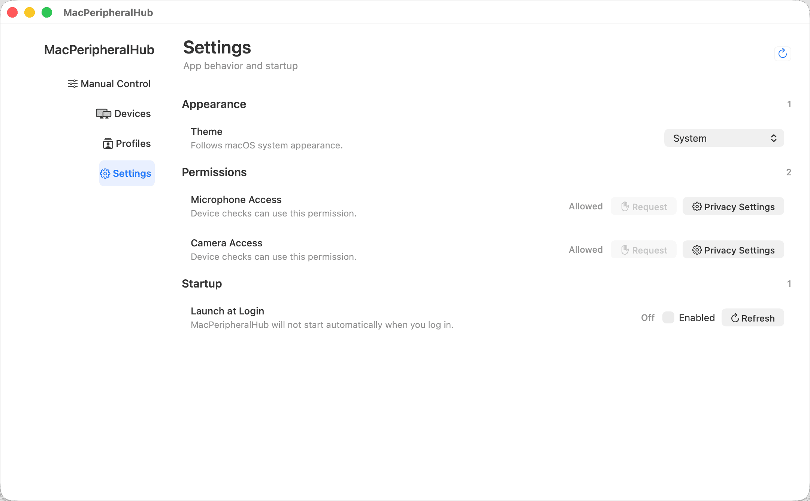
</div>

`Settings` contains application-level options and system permission controls.

The appearance selector can follow macOS automatically or force light or dark mode for the app.

The same view can request microphone and camera access again, open Privacy Settings, and enable or disable launch at login.

### Dark Appearance

<div align="center">
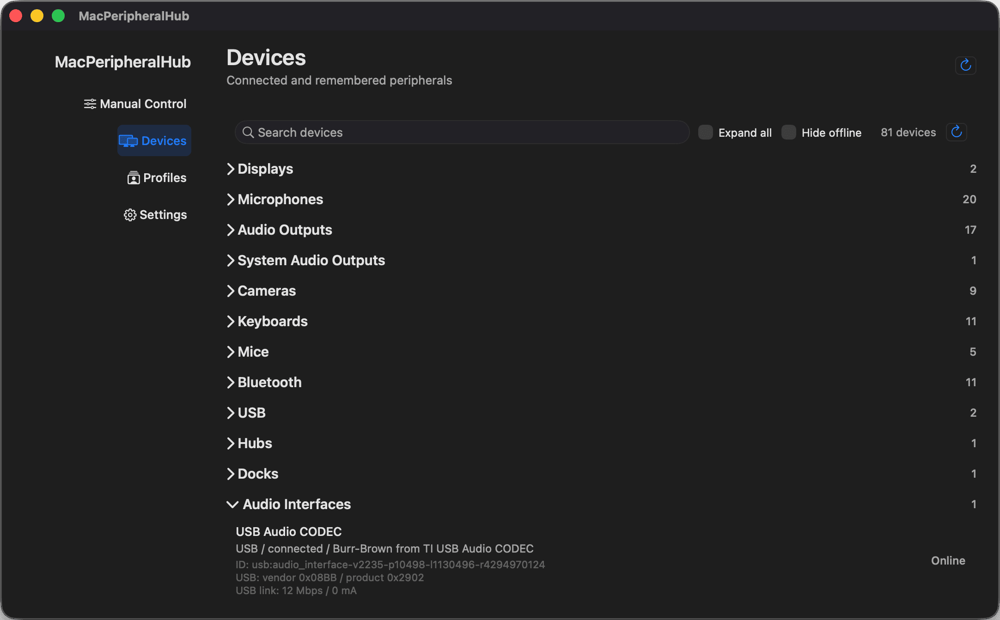
</div>

The dark appearance keeps the same workflow and layout while using macOS dark colors.

It can be selected manually in `Settings` or inherited from the system when appearance is set to `System`.

This makes the app comfortable to leave running while it watches audio defaults in the background.

### Menu Bar

<div align="center">
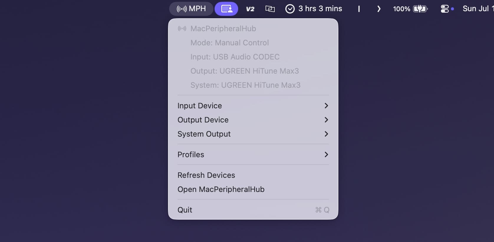
</div>

The menu bar item keeps MacPeripheralHub available after the main window is closed.

It shows compact status, active defaults, quick switching, profile activation, a command to reopen the window, and `Quit`.

This is the main background control surface when the app is running without a Dock window.

## macOS limitations

macOS gives applications a reliable system API for changing default audio input, default audio output, and default system output.

macOS does not provide the same universal forced default camera setting for all applications.

MacPeripheralHub stores a preferred camera in profiles and displays it in the UI, but the final camera selection can still depend on the application that uses the camera.

Keyboard, mouse, trackpad, USB hub, dock, and many generic USB or HID devices can be detected and described, but usually cannot be made globally active in the same way as audio devices.

The app documents permission and privacy behavior in `docs/PRIVACY.md`.

Hardware verification notes are recorded in `docs/MACOS_INTEGRATION_CHECKS.md`.

## Build from source

Requirements:

- macOS 13 or newer;
- Xcode with command line tools;
- the system SQLite library included with macOS.

Build, test, and create a local release app bundle:

    scripts/package_app.sh

The script runs the full local checks and then writes:

    dist/MacPeripheralHub.app
    dist/MacPeripheralHub.app.zip
    dist/MacPeripheralHub.app.zip.sha256

The checksum file verifies the release zip archive.

The same packaging step is available through Make:

    make package-app

## Running locally

Run the debug build from the repository:

    scripts/run_app.sh

Stop the running application:

    scripts/stop_app.sh

Build the debug app only:

    scripts/build_app.sh

Build the release app only:

    scripts/build_release.sh

## Tests

Run C-core tests:

    make test-core

Run the full local build and test flow:

    scripts/test_all.sh

`scripts/package_app.sh` also runs `scripts/test_all.sh` before copying the release app into `dist`.

## Architectural decisions

MacPeripheralHub is split into a native macOS shell and a portable C core.

Swift and AppKit are used for the application window, menu bar item, Dock behavior, system prompts, media test windows, and user-facing state.

This keeps the interface aligned with macOS behavior and avoids a web wrapper for system-level hardware work.

C is used for the largest and most durable part of the repository: device models, profile data, matching, storage-facing logic, reconciliation decisions, and tests.

That choice keeps the core deterministic, easy to exercise from small test binaries, and suitable for direct integration with low-level macOS frameworks.

The Swift layer talks to the C layer through a narrow bridge instead of duplicating device and profile rules in the UI.

SQLite is used because profiles, selected defaults, known devices, aliases, and migrations need durable local storage without a server or network dependency.

The app stores data in the user's local Application Support area and keeps the core workflow offline.

Inventory is collected from macOS APIs by role-specific adapters for audio, displays, cameras, USB, HID, and Bluetooth.

Those adapters normalize system-specific metadata into common core device records before the UI renders them.

Audio default protection is implemented as reconciliation rather than blind polling.

The app stores the desired input, output, and system output, watches device changes, debounces unstable connection moments, and restores only supported audio defaults.

Manual switching intentionally moves the active state into `Manual Control` so temporary choices do not overwrite saved profiles.

Camera handling is intentionally different from audio handling because macOS does not expose one universal default camera switch for all applications.

MacPeripheralHub can store a preferred camera, show it in profiles, and preview cameras, but final camera selection can still belong to each calling app.

Permission-sensitive features are user-triggered.

Microphone live monitoring and camera preview ask for macOS permission only when the user starts those checks, and `Settings` exposes status plus shortcuts back to Privacy Settings.

The menu bar item is part of the product architecture, not just a shortcut.

Closing the main window hides the Dock presence while background watchers continue to maintain selected audio defaults from the menu bar.

Build scripts are kept as first-class project entry points so the app can be tested, packaged, checksummed, and prepared for GitHub Releases with one command.

## Architecture diagrams

### project_structure.mmd

<div align="center">
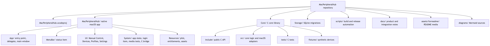
</div>

### system_interaction_flow.mmd

<div align="center">
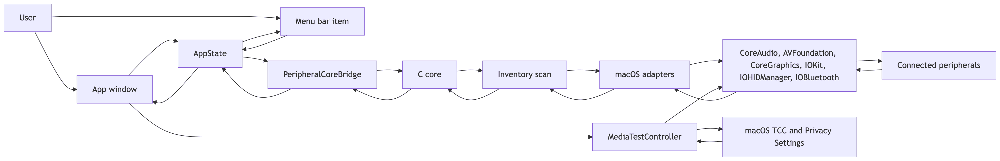
</div>

### audio_default_reconciliation.mmd

<div align="center">
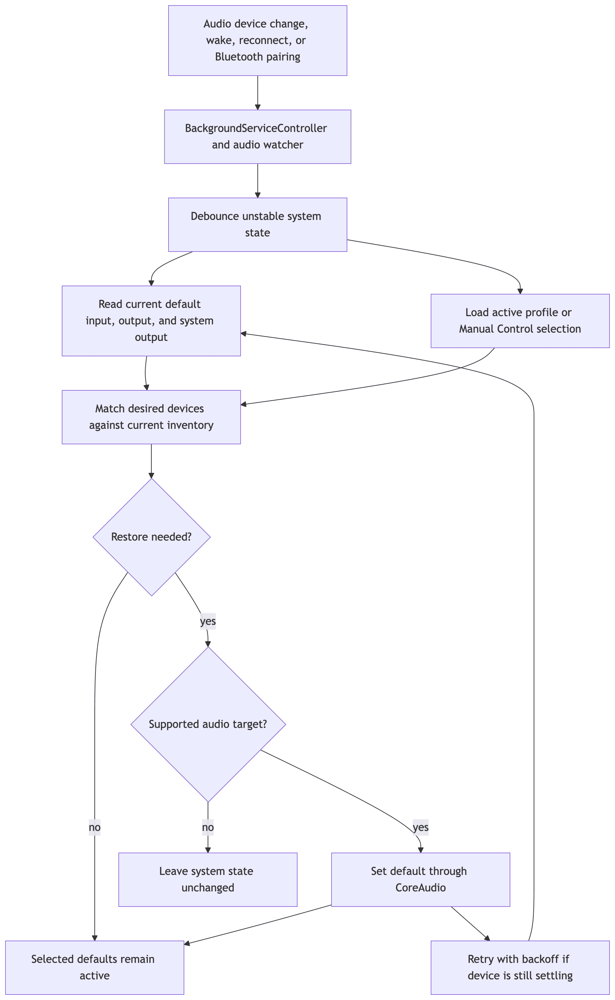
</div>

### media_checks_flow.mmd

<div align="center">
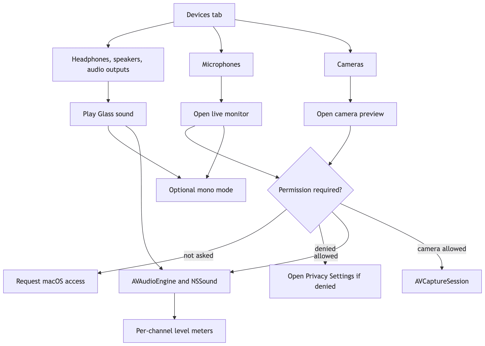
</div>

### profile_storage_flow.mmd

<div align="center">
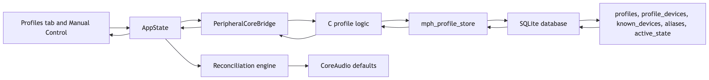
</div>

## Project structure

### Folder tree

```text
MacPeripheralHub/
├── MacPeripheralHub/
│   ├── App/                    App entry point, delegate, and main window
│   ├── MenuBar/                Menu bar controller and background access
│   ├── UI/                     Main tabbed AppKit interface
│   ├── System/                 Swift state, media checks, login item, and C bridge
│   └── Resources/              Info.plist, entitlements, icon, and app assets
├── Core/
│   ├── include/                Public C headers and Swift-visible module map
│   ├── src/                    C core logic and Objective-C macOS adapters
│   ├── tests/                  C smoke and integration-style tests
│   └── fixtures/               Synthetic device data for tests
├── Storage/
│   └── migrations/             SQLite schema migrations
├── scripts/                    Build, run, stop, test, and package scripts
├── docs/                       Product notes, roadmap, privacy, and integration checks
├── assets/forreadme/           README logo, walkthrough screenshots, and diagrams
└── diagrams/                   Mermaid diagram source files
```

### Detailed source map

    MacPeripheralHub/                                Native macOS AppKit application
    MacPeripheralHub/App/main.swift                  Application entry point
    MacPeripheralHub/App/AppDelegate.swift           App lifecycle, activation, close behavior, and startup flow
    MacPeripheralHub/App/MainWindowController.swift  Main application window controller
    MacPeripheralHub/MenuBar/StatusMenuController.swift
                                                     Menu bar status item, quick switching, profile activation, open window, and Quit
    MacPeripheralHub/UI/RootView.swift               Main tabbed UI for Manual Control, Devices, Profiles, and Settings
    MacPeripheralHub/System/AppState.swift           High-level observable app state and user actions
    MacPeripheralHub/System/BackgroundServiceController.swift
                                                     Background refresh and reconciliation coordinator
    MacPeripheralHub/System/CoreModels.swift         Swift view models mapped from the C core
    MacPeripheralHub/System/PeripheralCoreBridge.swift
                                                     Swift-to-C bridge for inventory, profiles, selections, storage, and reconciliation
    MacPeripheralHub/System/LoginItemController.swift
                                                     Launch-at-login integration
    MacPeripheralHub/System/MediaTestController.swift
                                                     Glass playback, microphone monitoring, camera preview, and media permissions
    MacPeripheralHub/Resources/Info.plist            Bundle metadata and macOS usage descriptions
    MacPeripheralHub/Resources/MacPeripheralHub.entitlements
                                                     Camera and audio-input entitlements for macOS privacy prompts
    MacPeripheralHub/Resources/Assets.xcassets       Application icon and accent assets
    Core/include/PeripheralCore.h                    Umbrella public C header
    Core/include/module.modulemap                    Clang module map for Swift and C integration
    Core/include/mph_core.h                          Core app context lifecycle
    Core/include/mph_device.h                        Device model, categories, roles, metadata, and status
    Core/include/mph_device_id.h                     Stable device identity and matching helpers
    Core/include/mph_inventory.h                     Inventory scan API and combined device collection
    Core/include/mph_profile.h                       Profile model and expected device selections
    Core/include/mph_profile_store.h                 SQLite-backed profile persistence API
    Core/include/mph_selection.h                     Active manual selection and desired defaults
    Core/include/mph_reconcile.h                     Desired-vs-current reconciliation decisions
    Core/include/mph_audio_watcher.h                 Audio watcher API for default-device protection
    Core/include/mph_core_audio.h                    CoreAudio enumeration and default switching
    Core/include/mph_swift_bridge.h                  C ABI consumed by Swift
    Core/include/mph_db.h                            SQLite connection, schema, and migration helpers
    Core/include/mph_display.h                       Display enumeration API
    Core/include/mph_camera.h                        Camera enumeration API
    Core/include/mph_usb.h                           USB and hub enumeration API
    Core/include/mph_hid.h                           Keyboard, mouse, and trackpad enumeration API
    Core/include/mph_bluetooth.h                     Bluetooth metadata API
    Core/src/                                        C implementations for core logic and macOS adapters
    Core/src/mph_core.c                              Core context wiring for database, inventory, and reconciliation
    Core/src/mph_profile_store.c                     SQLite profile, known-device, alias, and active-state storage
    Core/src/mph_reconcile.c                         Audio restore decisions and retry behavior
    Core/src/mph_audio_watcher.c                     CoreAudio listeners and background watcher worker
    Core/src/mph_swift_bridge.c                      Stable C functions used by the Swift application
    Core/src/mph_camera_avfoundation.m               AVFoundation camera adapter
    Core/src/mph_bluetooth_iobluetooth.m             IOBluetooth adapter
    Core/tests/test_core_smoke.c                     End-to-end C smoke test for storage, inventory, and watcher flow
    Core/fixtures/                                   Synthetic fixture snapshots for core test scenarios
    Storage/migrations/001_initial_schema.sql        Initial SQLite schema for profiles and device memory
    scripts/build_app.sh                             Debug app build command
    scripts/build_release.sh                         Release app build command
    scripts/run_app.sh                               Local app launch command
    scripts/stop_app.sh                              Local app stop command
    scripts/test_all.sh                              Full local test and build verification
    scripts/package_app.sh                           Test, release build, dist copy, zip, and checksum command
    docs/                                           Product notes, roadmap, privacy notes, and integration checks
    assets/forreadme/                                README logo and walkthrough images

## Technology stack

- Swift and AppKit for the macOS application shell and UI.
- C for the core models, profile logic, matching, reconciliation, and tests.
- SQLite for persistent profiles, known devices, aliases, and active state.
- CoreAudio for audio enumeration and default audio switching.
- AVFoundation for camera enumeration.
- CoreGraphics and IOKit for displays and system hardware metadata.
- IOHIDManager for keyboards, mice, trackpads, and other HID peripherals.
- IOBluetooth for Bluetooth device metadata where available.

## Architecture

Swift owns the user interface, menu bar integration, app lifecycle, Dock behavior, and high-level application state.

The C core owns the durable product logic: device models, stable matching, profile data, active selections, SQLite persistence, and reconciliation decisions.

System adapters collect live macOS state and convert it into core device records.

The reconciliation loop compares desired state with current state and applies only the supported audio changes.

This split keeps the macOS shell native while leaving the largest part of the repository in testable C code.

## Data and privacy

MacPeripheralHub stores profiles and known-device metadata locally in the user's Application Support directory.

The app does not need network access for its core workflow.

The app may ask macOS for camera or microphone-related permissions only where system APIs require them.

If permission is denied, the app should keep working and show whatever device information macOS still allows.

The app bundle is signed with camera and audio-input entitlements so macOS can show MacPeripheralHub in Privacy Settings.

## Version status

Current application version: `1.0.0`.

The app builds into a full macOS `.app` bundle named `MacPeripheralHub.app`.

Some hardware scenarios still require final manual verification on a real setup with the target USB microphone, Bluetooth headphones, displays, hubs, and sleep/wake behavior.
