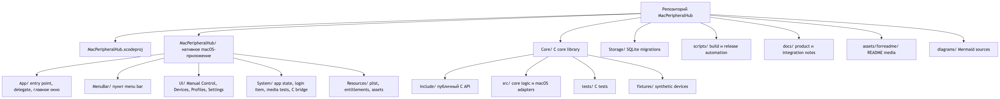
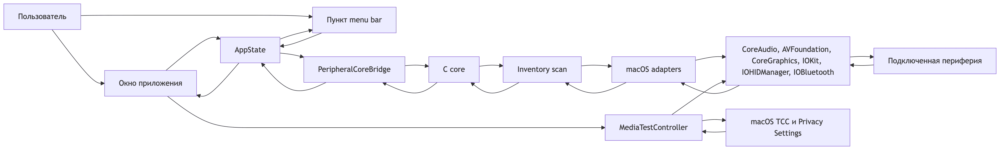
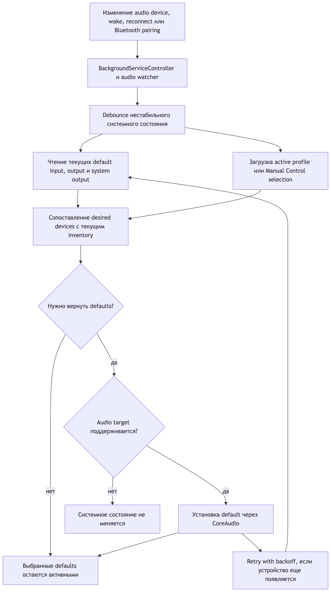
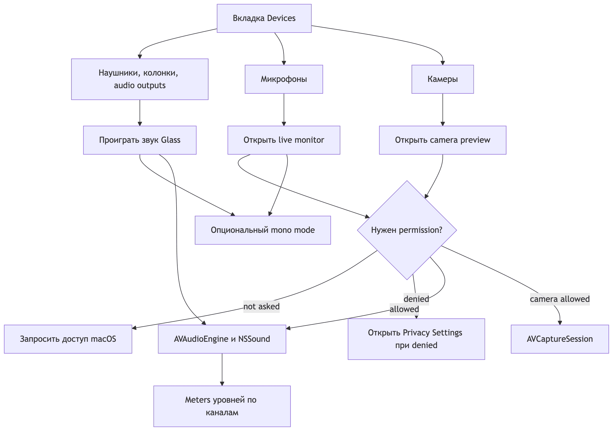
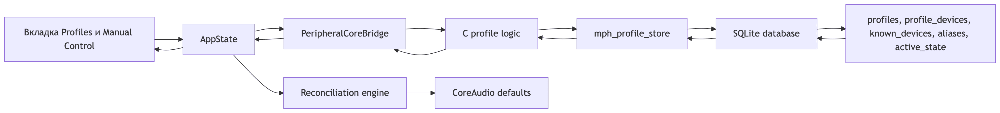

<div align="center">


# MacPeripheralHub

[](https://github.com/TheAndreyZakharov/MacPeripheralHub/blob/main/README_RU.md)
[](https://github.com/TheAndreyZakharov/MacPeripheralHub/blob/main/README.md)

</div>

## Harvard CS50x 2026 Final Project

- Курс: CS50x 2026 — Harvard University's Introduction to Computer Science
- Название проекта: MacPeripheralHub
- Автор: Андрей Захаров
- GitHub username: `TheAndreyZakharov`
- edX username: `TheAndreyZakharov`
- Город и страна: Москва, Россия
- Дата записи: TODO
- Video Demo: https://www.youtube.com/watch?v=by53T03Eeds
- Команда отправки: `submit50 cs50/problems/2026/x/project`

<div align="center">

[](https://www.youtube.com/watch?v=by53T03Eeds)

</div>

Ссылка на видео выше является временной заглушкой.

## Обзор проекта

MacPeripheralHub — это macOS-приложение для просмотра подключенной периферии, быстрого переключения активных аудиоустройств и удержания выбранных системных audio defaults.

Приложение сделано как обычное desktop-приложение macOS с настоящим окном, пунктом в menu bar, фоновыми watchers, хранением профилей и прямой интеграцией с системными API macOS.

Когда главное окно закрывается красной кнопкой, MacPeripheralHub пропадает из Dock и продолжает работать из menu bar рядом с часами macOS.

Публичная версия приложения — `1.0.0`.

## Назначение

MacPeripheralHub сделан для Mac-сетапов, где в течение дня подключается, отключается, соединяется или просыпается много устройств.

macOS и отдельные приложения могут менять default-микрофон или выход после появления гарнитуры, док-станции, монитора, USB-хаба или Bluetooth-устройства.

Например, пользователь может выбрать USB-микрофон как default input, позже подключить AirPods, и macOS может переключить default input на микрофон AirPods.

MacPeripheralHub удерживает выбранный audio input, audio output и system output, отслеживая системные изменения и возвращая нужные устройства.

## Поддерживаемые устройства

Inventory view рассчитан на показ максимального количества подключенной периферии, которую macOS отдает приложениям.

Категории устройств:

- мониторы и встроенные экраны;
- микрофоны;
- наушники, колонки и другие аудиовыходы;
- аудиоинтерфейсы и звуковые карты;
- камеры и веб-камеры;
- клавиатуры;
- мыши;
- трекпады;
- Bluetooth-устройства;
- USB-устройства;
- USB-хабы и док-станции;
- неизвестные или частично определенные устройства.

Для каждого устройства приложение показывает лучшие доступные данные: имя, категорию, производителя, модель, серийный номер, transport, статус подключения и характеристики роли.

Для мониторов приложение может показывать разрешение, частоту обновления, статус main display и доступную информацию о подключении.

Для аудиоустройств приложение может показывать каналы, sample rate и является ли устройство текущим default input, output или system output.

Для камер, HID-устройств, USB-устройств и Bluetooth-устройств приложение показывает идентификаторы и metadata, когда macOS их предоставляет.

## Главная функция

Главный защищаемый сценарий в версии `1.0.0` — стабильное управление audio defaults.

MacPeripheralHub хранит либо активный профиль, либо текущий ручной выбор.

Когда macOS меняет default input, output или system output с выбранного устройства на другое, reconciliation engine решает, нужно ли приложению вернуть выбранное устройство.

Приложение использует debounce и retry-поведение, чтобы не дергать macOS слишком резко, пока устройства еще появляются после подключения, wake или Bluetooth pairing.

Ручное переключение не перезаписывает сохраненные профили. Оно переводит active state в `Manual Control`, чтобы пользователь мог временно сменить устройства без разрушения сохраненного сетапа.

## Проверка устройств

В `Devices` встроены проверки для media-периферии.

Для наушников, колонок и аудиовыходов нажмите `Glass`, чтобы проиграть системный звук macOS Glass через выбранный output.

У проверки audio output есть опция `Mono` для центрированного mono playback.

Для микрофонов нажмите `Listen`, чтобы открыть live monitoring с meters уровней по каналам.

В окне микрофона тоже есть опция `Mono` для mono monitoring и mono level display.

Для камер нажмите `Preview`, чтобы открыть среднее окно preview для проверки кадра, фокуса и экспозиции.

Проверки микрофона и камеры запрашивают macOS permissions только когда пользователь запускает проверку.

`Settings` показывает статус permissions микрофона и камеры с действиями для повторного запроса доступа или открытия нужной страницы macOS Privacy Settings.

## Установка из GitHub Release

Готовое macOS-приложение доступно в разделе GitHub Releases этого репозитория.

Скачайте assets последнего релиза из GitHub Releases.

В релизе есть и application bundle, и файл контрольных сумм.

Release assets:

    MacPeripheralHub.app.zip
    MacPeripheralHub.app.zip.sha256

Положите `MacPeripheralHub.app.zip` и `MacPeripheralHub.app.zip.sha256` в одну папку.

Проверьте архив:

    shasum -a 256 -c MacPeripheralHub.app.zip.sha256

Распакуйте архив:

    unzip MacPeripheralHub.app.zip

При необходимости переместите приложение в `Applications`:

    mv "MacPeripheralHub.app" /Applications/

При первом запуске macOS может предупредить, что приложение не подписано и не notarized.

В этом случае нажмите по приложению правой кнопкой мыши и выберите `Открыть`.

Если quarantine мешает запуску, удалите quarantine-атрибут:

    xattr -cr "MacPeripheralHub.app"

или, если приложение уже перемещено в Applications:

    xattr -cr "/Applications/MacPeripheralHub.app"

## Обзор работы приложения

Этот раздел показывает основные сценарии и места, где MacPeripheralHub управляет подключенными устройствами или объясняет их состояние.

### Manual Control

<div align="center">

</div>

`Manual Control` — первая вкладка и самый быстрый способ вручную задать текущие defaults.

Здесь можно выбрать активный input, output, system output и preferred camera без изменения сохраненных профилей.

После ручного переключения приложение сохраняет текущее состояние как manual control, пока не будет активирован другой профиль.

### Devices

<div align="center">

</div>

`Devices` показывает все подключенное железо, которое macOS отдает приложению: проводные, беспроводные, audio, video, USB, Bluetooth, display, HID, hub и unknown devices.

Устройства сгруппированы по категориям, с раскрывающимися секциями и найденными metadata, чтобы было понятно, что это за устройство.

Media-устройства можно проверить прямо здесь: микрофоны можно прослушать live, outputs могут проиграть звук Glass, а камеры можно открыть в preview.

### Profiles

<div align="center">

</div>

`Profiles` нужен для переиспользуемых комбинаций устройств под разные задачи, места, звонки, стримы или рабочие сценарии.

Профиль может хранить выбранный input, output, system output, preferred camera и ожидаемую периферию.

Профили можно создавать, редактировать, удалять и быстро активировать, когда нужно переключить весь сетап.

### Settings

<div align="center">

</div>

`Settings` содержит настройки приложения и управление системными permissions.

Переключатель темы может автоматически следовать macOS или принудительно включать light или dark mode для приложения.

В этом же экране можно повторно запросить доступ к микрофону и камере, открыть Privacy Settings и включить или выключить launch at login.

### Dark Appearance

<div align="center">

</div>

Темная тема сохраняет тот же workflow и layout, но использует системные dark colors macOS.

Ее можно выбрать вручную в `Settings` или наследовать от системы, когда appearance выставлен в `System`.

Так приложение удобно оставлять запущенным, пока оно следит за audio defaults в фоне.

### Menu Bar

<div align="center">

</div>

Пункт в menu bar оставляет MacPeripheralHub доступным после закрытия главного окна.

Он показывает compact status, active defaults, quick switching, активацию профилей, команду повторного открытия окна и `Quit`.

Это основной фоновый control surface, когда приложение работает без окна в Dock.

## Ограничения macOS

macOS дает приложениям надежный системный API для смены default audio input, default audio output и default system output.

macOS не дает такого же универсального принудительного default camera для всех приложений.

MacPeripheralHub хранит preferred camera в профилях и показывает ее в UI, но финальный выбор камеры все равно может зависеть от приложения, которое использует камеру.

Клавиатуры, мыши, трекпады, USB-хабы, док-станции и многие обычные USB или HID-устройства можно обнаруживать и описывать, но обычно нельзя сделать глобально активными так же, как аудиоустройства.

Приложение документирует permissions и privacy behavior в `docs/PRIVACY.md`.

Заметки по hardware verification записаны в `docs/MACOS_INTEGRATION_CHECKS.md`.

## Сборка из исходников

Требования:

- macOS 13 или новее;
- Xcode с command line tools;
- системная SQLite library, которая входит в macOS.

Собрать, проверить и создать локальный release app bundle:

    scripts/package_app.sh

Скрипт запускает все локальные проверки и затем записывает:

    dist/MacPeripheralHub.app
    dist/MacPeripheralHub.app.zip
    dist/MacPeripheralHub.app.zip.sha256

Checksum-файл проверяет release zip archive.

Та же упаковка доступна через Make:

    make package-app

## Локальный запуск

Запустить debug build из репозитория:

    scripts/run_app.sh

Остановить запущенное приложение:

    scripts/stop_app.sh

Собрать только debug-приложение:

    scripts/build_app.sh

Собрать только release-приложение:

    scripts/build_release.sh

## Тесты

Запустить C-core tests:

    make test-core

Запустить полный локальный build and test flow:

    scripts/test_all.sh

`scripts/package_app.sh` тоже запускает `scripts/test_all.sh` перед копированием release-приложения в `dist`.

## Архитектурные решения

MacPeripheralHub разделен на нативную macOS-оболочку и переносимый C core.

Swift и AppKit используются для окна приложения, пункта menu bar, Dock behavior, системных prompts, окон проверки media и пользовательского состояния.

Так интерфейс остается согласованным с поведением macOS, а для системной работы с железом не нужен web wrapper.

C используется для самой большой и долгоживущей части репозитория: device models, profile data, matching, storage-facing logic, reconciliation decisions и tests.

Такой выбор делает core детерминированным, удобным для проверки маленькими test binaries и подходящим для прямой интеграции с низкоуровневыми macOS frameworks.

Swift-слой общается с C-слоем через узкий bridge, а не дублирует правила устройств и профилей в UI.

SQLite используется потому, что профилям, выбранным defaults, known devices, aliases и migrations нужно надежное локальное хранение без сервера и network dependency.

Приложение хранит данные в локальной пользовательской Application Support area и оставляет основной workflow offline.

Inventory собирается из macOS APIs через role-specific adapters для audio, displays, cameras, USB, HID и Bluetooth.

Эти adapters нормализуют системную metadata в общие core device records до того, как UI их отображает.

Защита audio defaults реализована как reconciliation, а не как слепой polling.

Приложение хранит desired input, output и system output, следит за изменениями устройств, делает debounce нестабильных моментов подключения и возвращает только поддерживаемые audio defaults.

Manual switching намеренно переводит active state в `Manual Control`, чтобы временный выбор не перезаписывал сохраненные профили.

Работа с камерами намеренно отличается от работы с audio, потому что macOS не дает одного универсального default camera switch для всех приложений.

MacPeripheralHub может хранить preferred camera, показывать ее в профилях и открывать camera preview, но финальный выбор камеры все равно может принадлежать конкретному приложению.

Permission-sensitive features запускаются только действием пользователя.

Microphone live monitoring и camera preview запрашивают macOS permission только когда пользователь запускает эти проверки, а `Settings` показывает статус и shortcuts обратно в Privacy Settings.

Пункт menu bar является частью продуктовой архитектуры, а не просто shortcut.

Закрытие главного окна скрывает присутствие в Dock, но background watchers продолжают удерживать выбранные audio defaults из menu bar.

Build scripts оставлены как основные входные точки проекта, чтобы приложение можно было проверить, упаковать, снабдить checksum и подготовить для GitHub Releases одной командой.

## Архитектурные диаграммы

### project_structure_ru.mmd

<div align="center">

</div>

### system_interaction_flow_ru.mmd

<div align="center">

</div>

### audio_default_reconciliation_ru.mmd

<div align="center">

</div>

### media_checks_flow_ru.mmd

<div align="center">

</div>

### profile_storage_flow_ru.mmd

<div align="center">

</div>

## Структура проекта

### Дерево папок

```text
MacPeripheralHub/
├── MacPeripheralHub/
│   ├── App/                    Entry point, delegate и главное окно приложения
│   ├── MenuBar/                Menu bar controller и фоновый доступ
│   ├── UI/                     Основной tabbed AppKit interface
│   ├── System/                 Swift state, media checks, login item и C bridge
│   └── Resources/              Info.plist, entitlements, icon и app assets
├── Core/
│   ├── include/                Public C headers и module map, видимый Swift
│   ├── src/                    C core logic и Objective-C macOS adapters
│   ├── tests/                  C smoke и integration-style tests
│   └── fixtures/               Synthetic device data для tests
├── Storage/
│   └── migrations/             SQLite schema migrations
├── scripts/                    Build, run, stop, test и package scripts
├── docs/                       Product notes, roadmap, privacy и integration checks
├── assets/forreadme/           README logo, walkthrough screenshots и diagrams
└── diagrams/                   Mermaid diagram source files
```

### Подробная карта файлов

    MacPeripheralHub/                                Нативное macOS AppKit-приложение
    MacPeripheralHub/App/main.swift                  Entry point приложения
    MacPeripheralHub/App/AppDelegate.swift           App lifecycle, activation, close behavior и startup flow
    MacPeripheralHub/App/MainWindowController.swift  Controller главного окна приложения
    MacPeripheralHub/MenuBar/StatusMenuController.swift
                                                     Menu bar status item, quick switching, profile activation, open window и Quit
    MacPeripheralHub/UI/RootView.swift               Главный tabbed UI для Manual Control, Devices, Profiles и Settings
    MacPeripheralHub/System/AppState.swift           High-level observable app state и user actions
    MacPeripheralHub/System/BackgroundServiceController.swift
                                                     Background refresh и reconciliation coordinator
    MacPeripheralHub/System/CoreModels.swift         Swift view models, сопоставленные с C core
    MacPeripheralHub/System/PeripheralCoreBridge.swift
                                                     Swift-to-C bridge для inventory, profiles, selections, storage и reconciliation
    MacPeripheralHub/System/LoginItemController.swift
                                                     Launch-at-login integration
    MacPeripheralHub/System/MediaTestController.swift
                                                     Glass playback, microphone monitoring, camera preview и media permissions
    MacPeripheralHub/Resources/Info.plist            Bundle metadata и macOS usage descriptions
    MacPeripheralHub/Resources/MacPeripheralHub.entitlements
                                                     Camera и audio-input entitlements для macOS privacy prompts
    MacPeripheralHub/Resources/Assets.xcassets       Application icon и accent assets
    Core/include/PeripheralCore.h                    Umbrella public C header
    Core/include/module.modulemap                    Clang module map для Swift и C integration
    Core/include/mph_core.h                          Core app context lifecycle
    Core/include/mph_device.h                        Device model, categories, roles, metadata и status
    Core/include/mph_device_id.h                     Stable device identity и matching helpers
    Core/include/mph_inventory.h                     Inventory scan API и combined device collection
    Core/include/mph_profile.h                       Profile model и expected device selections
    Core/include/mph_profile_store.h                 SQLite-backed profile persistence API
    Core/include/mph_selection.h                     Active manual selection и desired defaults
    Core/include/mph_reconcile.h                     Desired-vs-current reconciliation decisions
    Core/include/mph_audio_watcher.h                 Audio watcher API для default-device protection
    Core/include/mph_core_audio.h                    CoreAudio enumeration и default switching
    Core/include/mph_swift_bridge.h                  C ABI, который использует Swift
    Core/include/mph_db.h                            SQLite connection, schema и migration helpers
    Core/include/mph_display.h                       Display enumeration API
    Core/include/mph_camera.h                        Camera enumeration API
    Core/include/mph_usb.h                           USB и hub enumeration API
    Core/include/mph_hid.h                           Keyboard, mouse и trackpad enumeration API
    Core/include/mph_bluetooth.h                     Bluetooth metadata API
    Core/src/                                        C implementations для core logic и macOS adapters
    Core/src/mph_core.c                              Core context wiring для database, inventory и reconciliation
    Core/src/mph_profile_store.c                     SQLite profile, known-device, alias и active-state storage
    Core/src/mph_reconcile.c                         Audio restore decisions и retry behavior
    Core/src/mph_audio_watcher.c                     CoreAudio listeners и background watcher worker
    Core/src/mph_swift_bridge.c                      Stable C functions, которые использует Swift application
    Core/src/mph_camera_avfoundation.m               AVFoundation camera adapter
    Core/src/mph_bluetooth_iobluetooth.m             IOBluetooth adapter
    Core/tests/test_core_smoke.c                     End-to-end C smoke test для storage, inventory и watcher flow
    Core/fixtures/                                   Synthetic fixture snapshots для core test scenarios
    Storage/migrations/001_initial_schema.sql        Initial SQLite schema для profiles и device memory
    scripts/build_app.sh                             Debug app build command
    scripts/build_release.sh                         Release app build command
    scripts/run_app.sh                               Local app launch command
    scripts/stop_app.sh                              Local app stop command
    scripts/test_all.sh                              Full local test и build verification
    scripts/package_app.sh                           Test, release build, dist copy, zip и checksum command
    docs/                                           Product notes, roadmap, privacy notes и integration checks
    assets/forreadme/                                README logo и walkthrough images

## Стек технологий

- Swift и AppKit для macOS application shell и UI.
- C для core models, profile logic, matching, reconciliation и tests.
- SQLite для persistent profiles, known devices, aliases и active state.
- CoreAudio для audio enumeration и default audio switching.
- AVFoundation для camera enumeration.
- CoreGraphics и IOKit для displays и system hardware metadata.
- IOHIDManager для keyboards, mice, trackpads и другой HID-периферии.
- IOBluetooth для Bluetooth device metadata, где это доступно.

## Архитектура

Swift отвечает за пользовательский интерфейс, menu bar integration, app lifecycle, Dock behavior и high-level application state.

C core отвечает за устойчивую продуктовую логику: device models, stable matching, profile data, active selections, SQLite persistence и reconciliation decisions.

System adapters собирают live macOS state и конвертируют его в core device records.

Reconciliation loop сравнивает desired state с current state и применяет только поддерживаемые audio changes.

Такое разделение оставляет macOS shell нативным, а самую большую часть репозитория — в тестируемом C-коде.

## Данные и приватность

MacPeripheralHub хранит профили и known-device metadata локально в пользовательской директории Application Support.

Для основного workflow приложению не нужен network access.

Приложение может запрашивать у macOS permissions, связанные с камерой или микрофоном, только там, где этого требуют системные API.

Если permission отклонен, приложение должно продолжать работу и показывать ту информацию об устройствах, которую macOS все еще разрешает.

App bundle подписывается с camera и audio-input entitlements, чтобы macOS могла показывать MacPeripheralHub в Privacy Settings.

## Статус версии

Текущая версия приложения: `1.0.0`.

Приложение собирается в полноценный macOS `.app` bundle с названием `MacPeripheralHub.app`.

Некоторые hardware scenarios все еще требуют финальной ручной проверки на реальном сетапе с целевым USB-микрофоном, Bluetooth-наушниками, мониторами, хабами и sleep/wake behavior.
